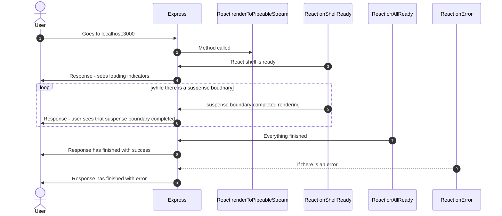
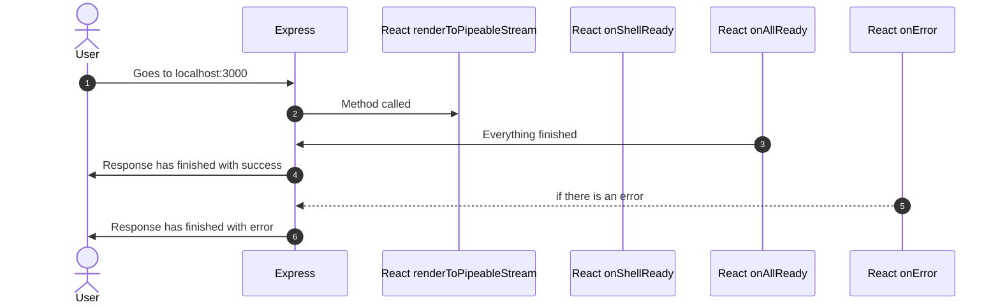

# Vite Example with for React 18 Streaming

# Getting Started

## Install dependencies

```
yarn
```

## Start the server

```
yarn dev
```

This will start a server at `3000`.

# How it works

This utilizes [Vite's SSR mode](https://vitejs.dev/guide/ssr.html). For development, this runs Vite as a middleware on [Express](https://expressjs.com/).

An `index.html` was created. It has `<!--ssr-outlet -->` as a comment. This comment block is the location where SSR content is inserted.

When the server is launched, it reads the `index.html` and puts that in the server's memory.

When the user goes to `http://localhost:3000`, in development:

1. The server applies the transforms for index.html.
2. [`vite`](https://vitejs.dev/) loads the [`/src/entry-server.tsx`](/src/entry-server.tsx) module, and we destruct the render method.
3. We then call the `render` method from (2) and that is used as the output of the endpoint.

In the `render` method,

If streaming is turned on,

1. We look for the `<-- ssr-outlet -->` comment and split the index.html into 2 parts. We write the content-type header first, then write the first part.
2. We then utilize [`renderToPipeableStream's flow`](https://reactjs.org/docs/react-dom-server.html#rendertopipeablestream).
3. `onShellReady` is called via `renderToPipeableStream` when the shell of suspense boundaries are ready. To the user, this is when all of the components see `Loading`. When a suspense boundary has completed loading, `renderToPipeableStream` will pipe the rest of the contents over to the user
4. `onAllReady` is called via `renderToPipeableStream` when everything has completed loading. If no error occurred, then we write the rest of the HTML.
5. `onError` is called when any error has occurred. This then results in a 500.

If Streaming is turned off, no response is returned until `onAllReady` or `onError` is called.

Here's a sequence diagram that explains the render method when streaming:



Here's a sequence diagram that explains the render method when not streaming:



# Special Environment Variables

```
VITE_APP_DISABLE_STREAMING=1
```

This disables streaming.
